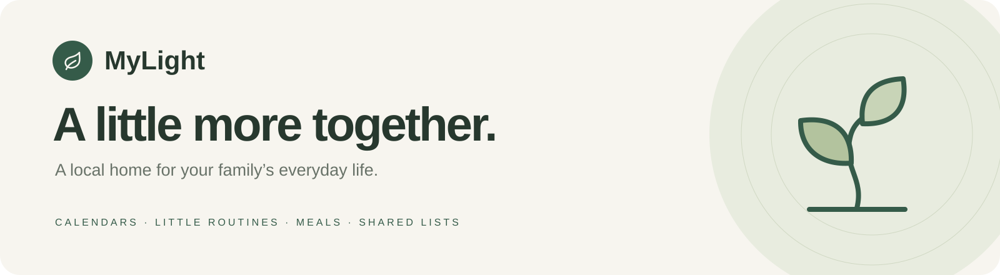
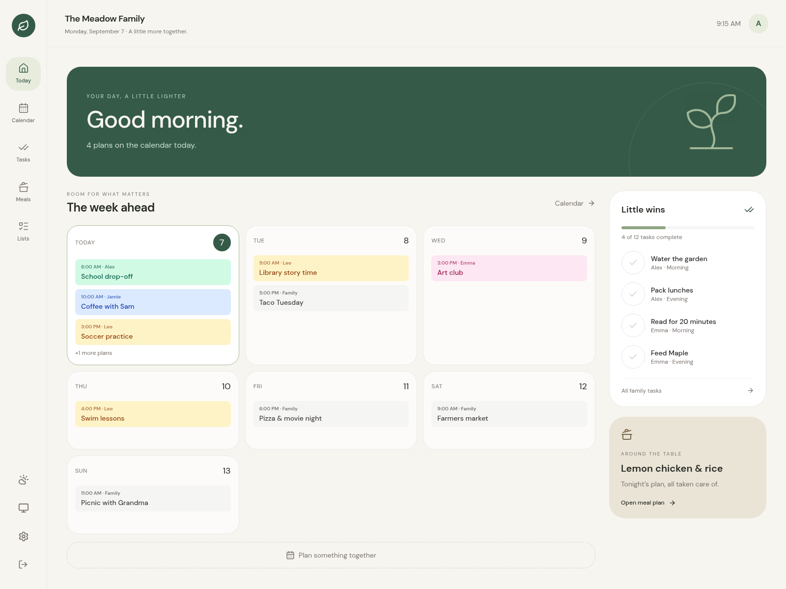
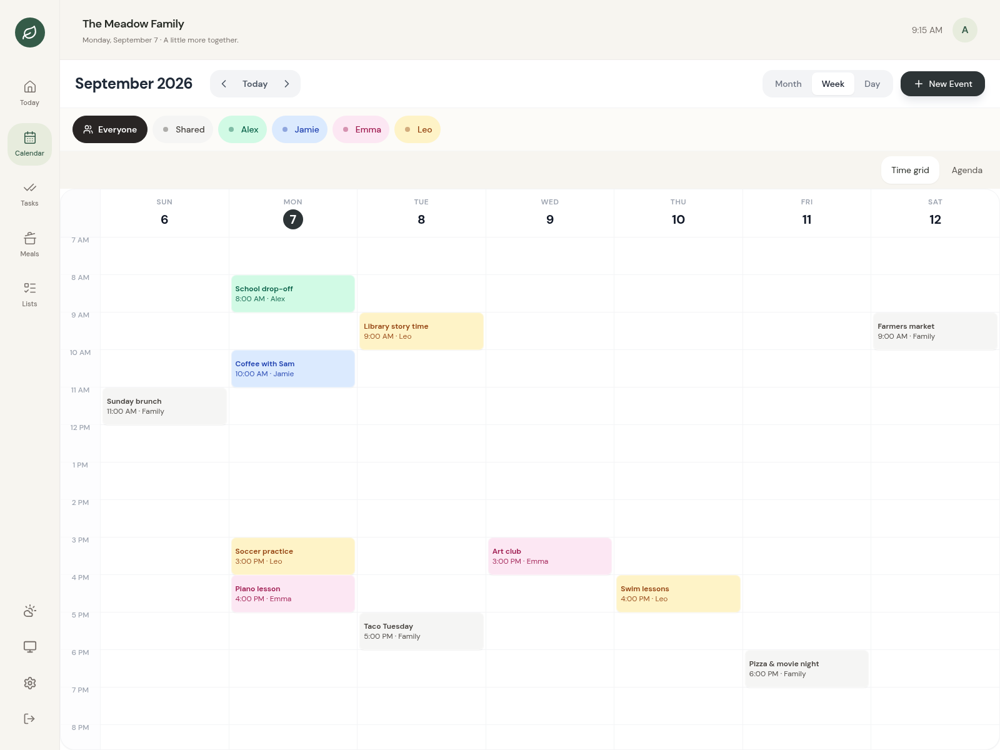
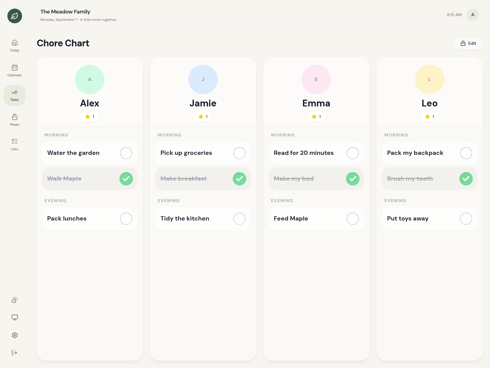
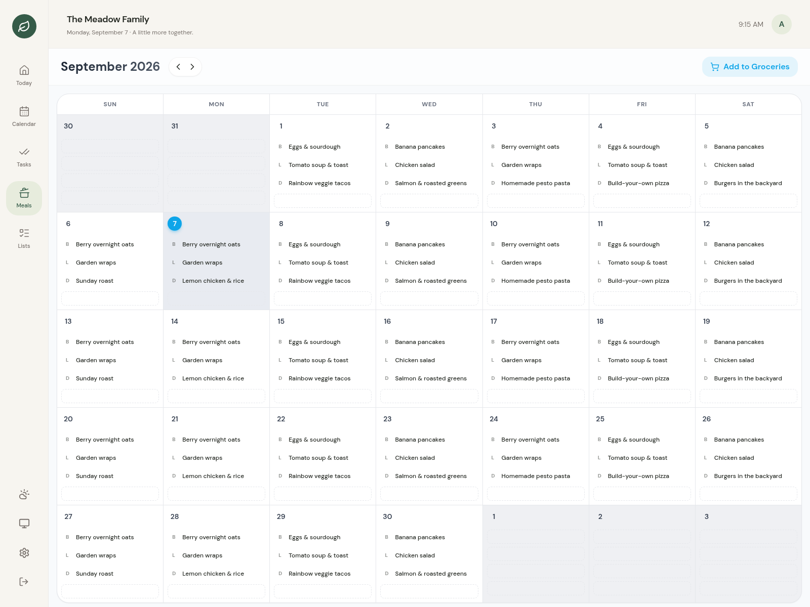
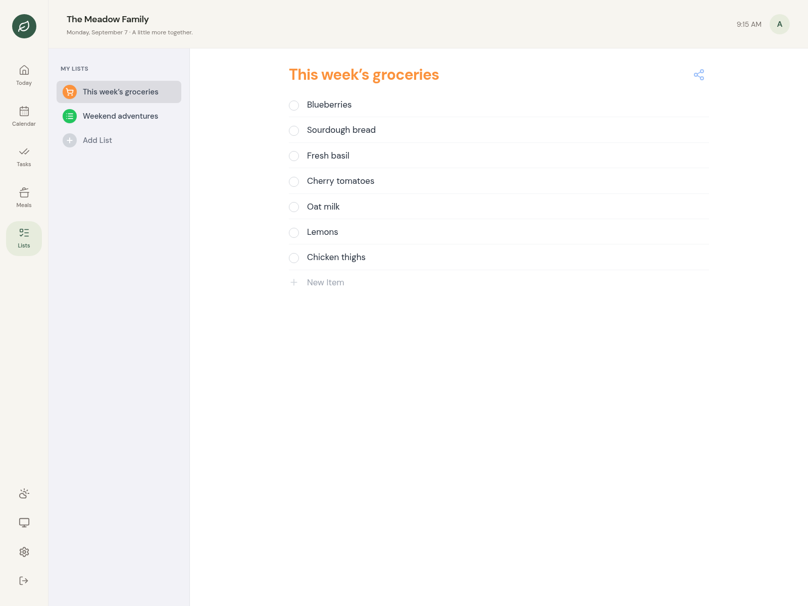
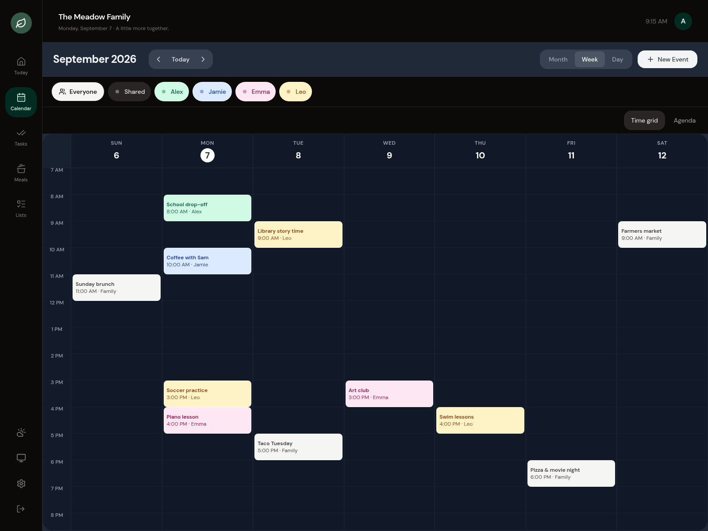

<p align="center">
  
</p>

<p align="center">
  <a href="https://github.com/zachwilke/mylight/actions/workflows/ci.yml"></a>
  
  
</p>

<p align="center">
  <a href="#get-started"><b>Get started</b></a> ·
  <a href="#a-look-inside">Screenshots</a> ·
  <a href="docs/OPERATIONS.md">Household guide</a> ·
  <a href="https://github.com/zachwilke/mylight/releases">Releases</a>
</p>

School runs, soccer practice, dinner plans, and the little things that keep a home moving. **MyLight brings them into one calm, shared space**—on your computer, your phone, or a family wall display.

Runs on your own hardware. Your household data stays on your server. No hosted account or subscription is required for local features.



<p align="center"><sub>Your day, a little lighter. Real app screenshots with fictional household data.</sub></p>

## Get started

**Linux & macOS** · One installer. No Docker, Node, Go, or sudo required.

```sh
curl -fsSL https://github.com/zachwilke/mylight/releases/latest/download/install.sh | sh
```

Start MyLight:

```sh
~/.local/bin/mylight
```

Open **[localhost:3000](http://localhost:3000)**, create your household, and add your family. That’s it.

The installer selects your platform, verifies the executable’s SHA-256 checksum, and installs into `~/.local/bin`. Your database and uploads live in `~/.local/share/mylight/data`. Press **Ctrl+C** to stop; your data stays put.

**Windows?** Download **[mylight-windows-amd64.exe](https://github.com/zachwilke/mylight/releases/latest/download/mylight-windows-amd64.exe)** into a dedicated folder and double-click it. Open the same address above. See the [installation guide](docs/INSTALL.md) for checksum verification, macOS signing notes, manual downloads, updates, and running at login.

> Release downloads become available after the first tag is published with the new release workflow. Until then, use the source or Docker instructions below.

<details>
<summary><b>Prefer Docker?</b></summary>

```sh
git clone https://github.com/zachwilke/mylight.git
cd mylight
docker compose up -d --build
```

Open **http://localhost:3000**. This builds the image locally and stores your household in the `mylight-data` volume. Use `docker compose down` to stop. Adding `-v` deletes the volume and its data.

</details>

## A look inside

<table>
  <tr>
    <td width="50%">
      <h3>One family. One calendar.</h3>
      <p>See the week together, find everyone’s plans, and filter by family member.</p>
      <a href="docs/images/calendar.png"></a>
    </td>
    <td width="50%">
      <h3>Little routines. Real progress.</h3>
      <p>Morning and evening tasks, a column for each person, and stars for little wins.</p>
      <a href="docs/images/tasks.png"></a>
    </td>
  </tr>
  <tr>
    <td width="50%">
      <h3>“What’s for dinner?” Handled.</h3>
      <p>Put breakfast, lunch, and dinner on the calendar so everyone knows the plan.</p>
      <a href="docs/images/meals.png"></a>
    </td>
    <td width="50%">
      <h3>A place for all the little lists.</h3>
      <p>Groceries, weekend ideas, and things to remember—shared across the household.</p>
      <a href="docs/images/lists.png"></a>
    </td>
  </tr>
</table>

<details>
<summary><b>After hours: see MyLight in dark mode</b></summary>



Choose **Light**, **Dark**, or **System** to suit your space.

</details>

## At home on your hardware

| A little more… | What MyLight brings |
| :--- | :--- |
| **Together** | Today dashboard, day/week/month calendars, family filters, recurring events, and read-only iCalendar subscriptions. |
| **In rhythm** | Daily tasks, stars, household-timezone resets, meal planning, and shared lists. |
| **Connected** | Live updates across browsers and optional private remote access through embedded Tailscale. |
| **Visible** | Responsive layouts, light/dark themes, photos, and restricted paired wall displays. |
| **Yours** | A Go server, embedded React UI, SQLite storage, downloadable backups, and local owner recovery. |

**Put it on a shared screen.** Open `/pair` on the display, then approve its code in **Settings → Displays** from your owner account. Choose view-only access or allow task completion. [Pairing guide →](docs/OPERATIONS.md#pair-a-restricted-wall-display)

**Take it beyond the kitchen.** Optional embedded Tailscale gives you a private HTTPS address for access away from home. [Remote access guide →](docs/OPERATIONS.md#native-tailscale-support)

Complete owner setup before sharing the server on your trusted home network. For another device, open `http://YOUR_SERVER_IP:3000`. Use private remote access rather than forwarding port 3000 to the public internet.

## Keep your household safe and sound

Download a backup in **Settings → Backup** before updating, and keep a copy off the server. Stop MyLight, rerun the installer, then start it again. Your household data is preserved.

Backups contain private household information and aren’t encrypted. Restore with a compatible build; don’t run older code against an upgraded database. [Backup, restore & recovery →](docs/OPERATIONS.md#backup-and-restore)

**Still growing.** MyLight is under active development. Calendar subscriptions are read-only; two-way Google/iCloud/Outlook sync, advanced child permissions, rewards catalogs, AI imports, offline edits, and mobile push notifications are unfinished. Weather and maps need network access. [Detailed status →](docs/IMPLEMENTATION_STATUS.md)

## Build something lovely

For local development, use **Node.js 22+**, **npm**, and **Go 1.26.6+**:

```sh
npm ci
npm run dev
```

Open **http://localhost:5173**. To build the self-contained executable, run `make build`, then `./mylight`.

```sh
npm run build
npm run lint
npm test
go test -C go-server -race ./...
go vet -C go-server ./...
python3 scripts/test-install.py
```

[Operating guide](docs/OPERATIONS.md) · [Installation details](docs/INSTALL.md) · [Publishing releases](docs/RELEASING.md) · [Refreshing screenshots](docs/SCREENSHOTS.md) · [Roadmap](docs/COMPLETION_PLAN.md)

---

<p align="center"><sub>Made for the everyday things that make a family.</sub></p>
